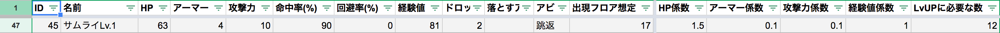

# 敵
- ダンジョンに潜むプレイヤーを倒そうとしてくるキャラクターです
- 出現した時に8方向の未識別セルをロック状態にします

## ステータス
- 全てのデータは[スプレッドシート](https://docs.google.com/spreadsheets/d/15rXLu7xYhgzawgrjlfpExmsEUf8ZRnx_B_J2VGMdSSY/edit#gid=42248239)で管理しています
- 以下、スプレッドシートで使われている計算式などの説明です

### 各ステータスの算出方法

#### 前提
- **出現フロア想定**と言う値は、その値付近のフロアに出現する敵と言う意味です
    - **プレイヤーのレベルもフロア数とほぼ同一である**と考えています
    - プレイヤー成長曲線も上記スプレッドシートの[別シート](https://docs.google.com/spreadsheets/d/15rXLu7xYhgzawgrjlfpExmsEUf8ZRnx_B_J2VGMdSSY/edit#gid=0)で作成しています

#### 算出方法
- ヒットポイントとアーマーは**出現フロア想定のプレイヤーの攻撃に何発耐えられるか**で計算しています
    - 式 = ***(プレイヤーの攻撃力 * 敵のヒットポイント係数)***
- 攻撃力は**出現フロア想定のプレイヤーを何発で倒せるか**で計算しています
    - 式 = ***(プレイヤーのヒットポイント * 敵の攻撃力係数)***
- 経験値は**出現フロア想定のプレイヤーの必要経験値と経験値取得倍率**で計算しています
    - 式 = ***(プレイヤーがレベルアップに必要な経験値 * (経験値取得倍率 * 敵の経験値係数))***
    - ~~今思うと経験値計算のみ特殊~~
    - 要は`1階の時は10体程倒せばレベルが上がって欲しいが75階では20体程倒して欲しい設計`を目指してた
    - もう変更する予定は無いので :yurusite:

#### 例

- サムライLv.1の場合
    - 出現フロア想定
        - `17`
        - プレイヤーの状態（`Lv.17`想定）
            - ヒットポイント = `100`
            - 攻撃力 = `42`
            - `Lv.18`に必要経験値 = `922`
            - 経験値取得倍率 = `0.088`
    - ヒットポイント
        - HP係数が`1.5`なので ***(42 * 1.5) =*** `63`
    - 攻撃力
        - 攻撃力係数が`0.1`なので ***(100 * 0.1) =*** `10`
    - 経験値
        - 経験値係数が`1`なので ***(922 * (0.088 * 1)) =*** `81`
