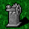

# ダンジョンについて
- ダンジョンとは`7*8`マスで構成されるマスの事で様々なイベントがランダムに仕込まれます

## 基本システム

### 流れ
- ダンジョンを入る、または降りる事でブランクセル1つが開いた状態から始まります
- 未識別セル（薄影の付いたセル）は踏む事が可能で、踏むと上下左右のセルが未識別セルになります
- 真っ黒なセルは進む事が出来ません
- これを繰り返して階段セルを踏んでさらに下層へ進んでいきます
- ダンジョン毎に指定された階数を進めばクリアとなります

### セルの状態
#### ブランクセル

- イベントが何もないセル
#### 未識別セル

- 踏むまでイベントがあるか分からないセル
#### 透視セル

- 状態は未識別セルと同様ですが、イベントが見えている状態
- 例外として石像は踏まれるまで判明されません
#### 黒セル ブラックセル

- 踏む事が出来ないセル
#### ロックセル

- 敵が出現した時に8方向にある未識別セル、または黒セルがロックされた状態
- 状態は黒セルと同じです
### イベントの種類
#### ハート

- ヒットポイントを`5`回復します
- 最大値を超えて回復します
#### 金床

- アーマーを5回復します
#### 階段

- 次の階へ進む事が出来ます
#### アイテム

- 拾う事が可能なアイテムです
#### 敵

- プレイヤーの邪魔をしてきます
#### ショップ

- ショップへ訪問出来ます
#### 鍛冶屋

- 鍛冶屋へ訪問出来ます
#### 石像

- プレイヤーと敵全てに対して何かしらの効果が発揮します
- 詳細は石像についてを参照
#### 罠

- プレイヤーに対してネガティブな効果を与えます
- 詳細は罠についてを参照
