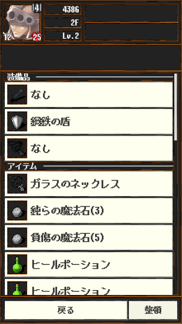

## アイテム画面

- 装備品
    - 現在装備している装備品は上部ヘ表示されます
- 所持品
    - アイテムは最大で24個まで持つことが出来ます
- 整頓
    - アイテムを整頓出来ます
    - 順番は以下となります
        - 武器
        - 盾
        - アクセサリー
        - 投擲物
        - 魔法石
        - ポーション