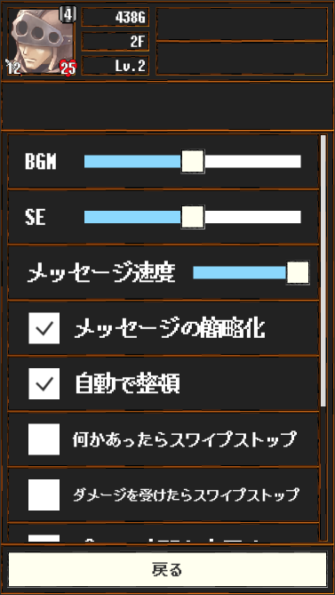

## 設定画面

- BGM
    - 音楽の音量を設定します
- SE
    - 効果音の音量を設定します
- メッセージ速度
    - 情報画面の表示速度を設定します
- メッセージの簡略化
    - 情報画面のメッセージ量を設定します
    - 有効にすることで簡略されるメッセージ群は以下となります
        - ダメージが通った際のメッセージ
            - *`Attacker`は`Target`に`x`のダメージを与えた！*
        - 敵が混乱状態で敵に攻撃した際のメッセージ
            - *`Attacker`は混乱している！`Target`に`x`のダメージを与えた！*
    - **※今後も増える可能性があります**
        - :eyes: `OptionData.IsFewMessage`
- 自動で整頓
    - アイテムを拾った際に所持品を自動で整頓するか設定します
- 何かあったらスワイプストップ
    - スワイプでフィールド移動中に`空白ではないセル`を踏んだ場合はスワイプ処理を停止します
- ダメージを受けたらスワイプストップ
    - スワイプでフィールド移動中にダメージを受けた場合はスワイプ処理を停止します
- プレイ時間を表示する
    - フィールド右下のプレイ時間の可視性を設定します
- プレイ時間を常に手前に表示
    - プレイ時間をいかなる状況でも手前に表示するか設定します
- 冒険をあきらめる
    - ダンジョンを攻略を中止して村へ戻ります
    - 死亡と同様に扱われるのでアイテムとお金は全て没収されます
- セーブデータを削除
    - セーブデータを削除してチュートリアル開始地点から始まります