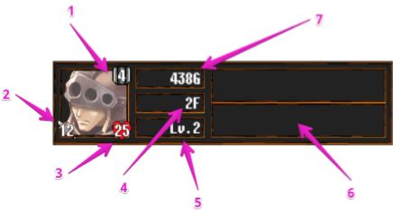
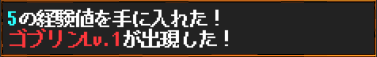
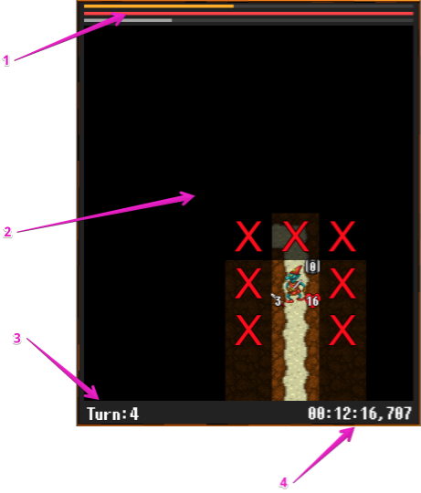
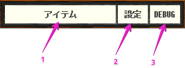

## 各画面について

## 基本的な画面

1. アーマー
2. 攻撃力
3. ヒットポイント
4. 現在の階数
5. プレイヤーのレベル
6. 状態異常
    - 上段がバフで下段がデバフとなっています
7. お金

- プレイヤーの起こしたアクションに対して何かしらの情報が表示されます

1. プレイヤーステータスゲージ
    - 黄色：経験値ゲージ
        - これが最大値になるとレベルアップします
    - 赤色：ヒットポイント
    - 灰色：アーマー
2. フィールド
    - ユーザーはこの領域をタップまたはスワイプしてダンジョンを攻略します
3. ターン数
4. プレイ時間
    - ダンジョン攻略を開始したタイミングから、クリアまたは死亡までの区間をカウントしています

1. アイテム
    - 所持しているアイテムを表示します
2. 設定
    - BGMやSEなどの調節を行います
3. DEBUG
    - デバッグビルドのみ実行可能なチート群